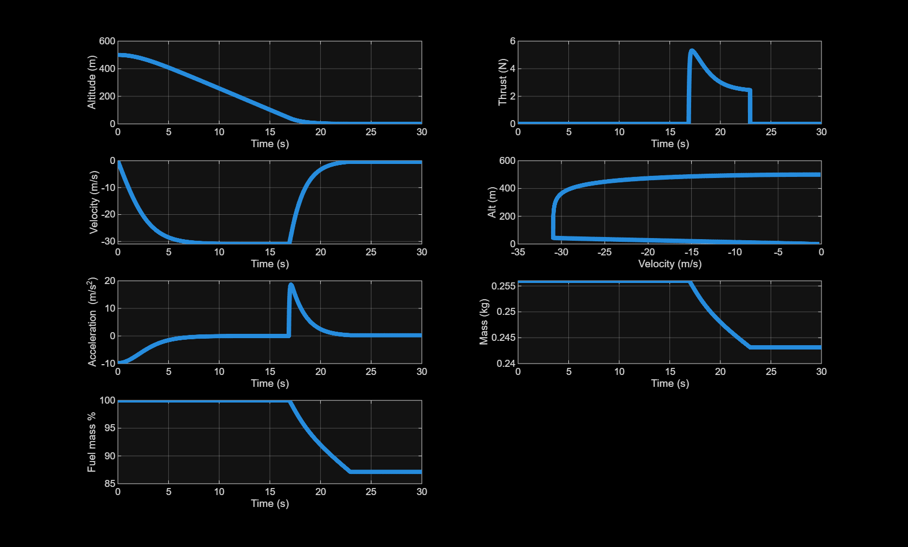

# LQR-Controlled 1D Rocket Landing Simulation

**High-Powered L1 Rocket | Powered Descent & Soft Landing**

This simulation implements a **Linear Quadratic Regulator (LQR)** for the 1D vertical landing of a high-powered L1-class rocket. The model includes atmospheric drag, propellant mass flow, gravity feedforward, and actuator saturation.

## Key Features

- Quadratic drag: `0.5·ρ·Cd·A·v²`
- Fuel mass depletion based on throttle
- Gravity feedforward to cancel dominant disturbance
- Thrust saturation [0, maxthrust]
- Simulation stops at landing (altitude ≤ 0.5 m)
- Time-varying LQR (A and B updated each timestep)
## Simulation Parameters

| Parameter | Value | Description |
|-----------|-------|-------------|
| Dry mass | 0.156 kg | Structure + avionics |
| Initial fuel | 0.1 kg | Propellant mass |
| Gravity | 9.81 m/s² | g |
| Initial altitude | 500 m | Starting height |
| Initial velocity | 0 m/s | Dropped from rest |
| Max time | 30 s | Simulation limit |
| Max thrust | 100 N | Engine limit |
| Altitude error scaling | 40 m | Q(1,1) weighting |
| Velocity error scaling | 30 m/s | Q(2,2) weighting |
| Time step | 0.01 s | Simulation resolution |

### Rocket Physical Properties

| Parameter | Value |
|-----------|-------|
| Diameter | 0.22 m |
| Cross-sectional area | ~0.038 m² |
| Drag coefficient (Cd) | 0.45 |
| Max mass flow rate | 0.0625 kg/s |

## Controller Design

**State vector:** `x = [altitude_error; velocity_error]`

**Q matrix:** `diag([1/40², 1/30²])` — normalizes errors

**R scalar:** `1/100²` — normalizes control effort

**Control law:** `u = -K·x + m·g` (LQR feedback + gravity feedforward)

The LQR gain `K` is recomputed at each time step because the system dynamics change with velocity (drag) and mass.

## How to Run

In MATLAB, run:

```matlab
[t, alt, velo, accel, thrust, mass, fmass] = LQR_1D_Sim(0.156, 0.1, 9.81, 500, 0, 30, 100, 40, 30, 0.01);
```

### Plot Results



## Expected Output

```
Landed at t = 8.45 s | Final velocity = -0.23 m/s
```

The rocket lands softly (velocity near zero) within ~8–10 seconds.

